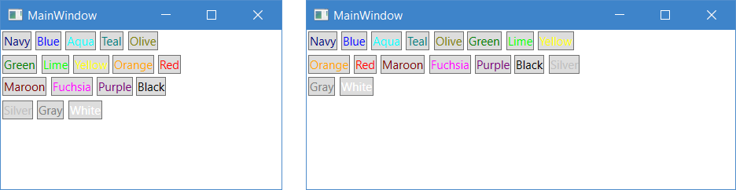
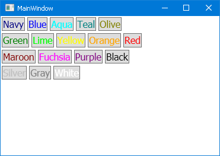

# Тема: Grid

Необхідно розробити додаток містить набір кнопок, які займають 2/3 ширини вікна при будь-яких його розмірах. Кожна кнопка повинна в якості вмісту відображати назву кольору і володіти зовнішнім відступом рівним 2.0. Також відповідний колір повинен використовуватися в якості кольору переднього плану кнопки. Необхідно використовувати наступний набір: Navy, Blue, Aqua, Teal, Olive, Green, Lime, Yellow, Orange, Red, Maroon, Fuchsia, Purple, Black, Silver, Gray, White.

# Результат

