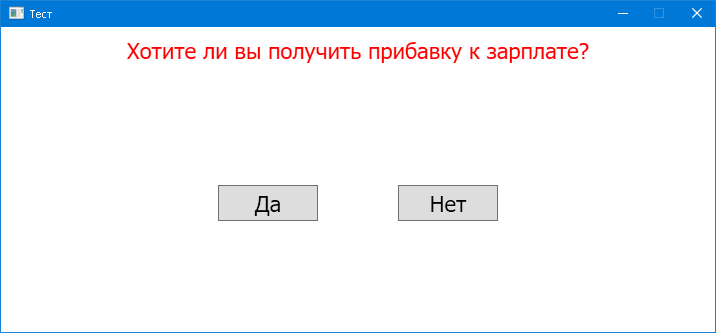

# Тема: Компоновка

Створіть додаток за поданим зразком

При наведенні миші на кнопку «Да» кнопка змінює своє місце розташування. Користувач не повинен натиснути на неї. При натисканні на кнопку «Нет», вивести повідомлення «Дякую за економію».

# Результат

