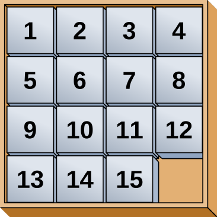
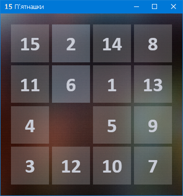

# Тема: Style

Розробити гру «П’ятнашки» — популярна головоломка, придумана у 1878 році Ноєм Чепменом. Складається з 15 однакових квадратних пластинок з нанесеними числами від 1 до 15. Пластинки поміщаються в квадратну коробку, довжина сторони якої в чотири рази більша довжини сторони пластинок, відповідно в коробці залишається незаповненим одне квадратне поле. Мета гри — переміщаючи пластинки по коробці добитися впорядковування їх по номерах (як зображено на рисунку), бажано зробивши якомога менше переміщень.

Обов’язково розробити стилі до елементів. Добавити тригери для анімації.

# Результат

Зроблено з використанням стилів, триггерів та шаблону проєктування архітектури застосунків (додатків) MVVM (Model-View-ViewModel).

Сделано с использованием стилей, триггеров и шаблона проектирования архитекруры приложения MVVM (Model-View-ViewModel).

