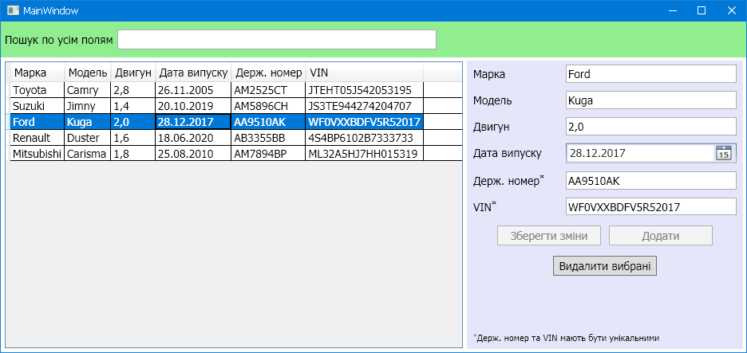

# Тема: MVVM

Розробити додаток для роботи з колекцією автомобілів з використанням шаблону проектування MVVM. Додаток повинен мати змогу додавати, видаляти, змінювати, фільтрувати дані по всі полям.

# Результат

